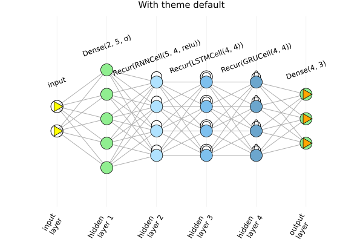
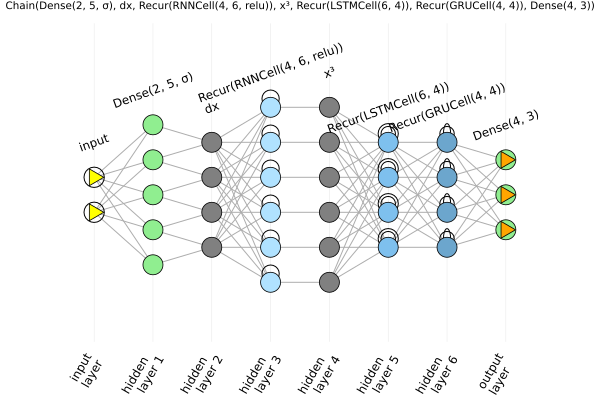
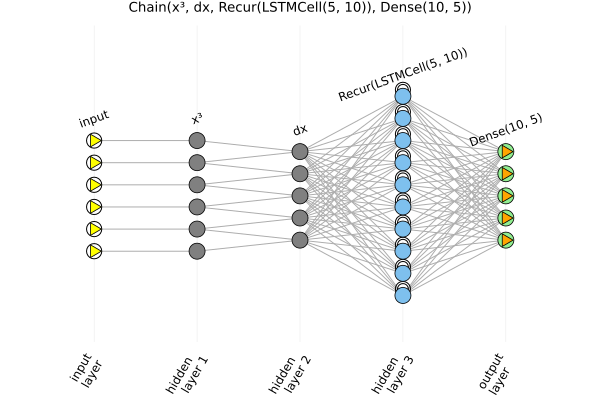
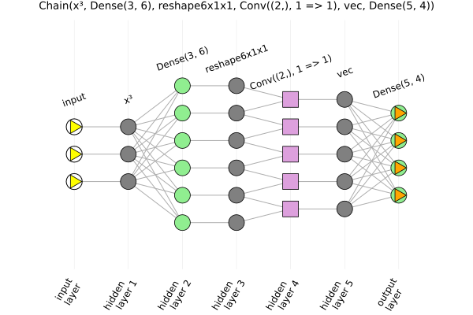
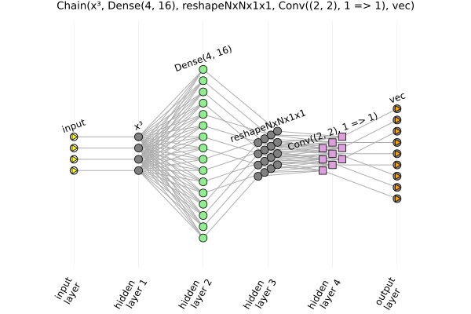
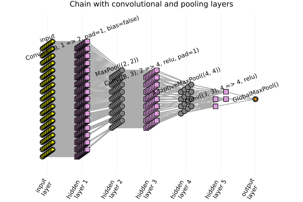

# ChainPlots

[](https://rmsrosa.github.io/ChainPlots.jl/dev/) 
 [](https://codecov.io/gh/rmsrosa/ChainPlots.jl) [](https://opensource.org/licenses/MIT)  

Graph generator and Plot recipes of the topology of [FluxML/Flux.jl](https://github.com/FluxML/Flux.jl)'s neural networks composed with [Flux.Chain](https://fluxml.ai/Flux.jl/stable/models/layers/#Flux.Chain).

## Description

It implements a plot recipe for `Flux.Chain` using the recipe tool from [JuliaPlots/RecipesBase.jl](https://github.com/JuliaPlots/RecipesBase.jl).

It first generates a [MetaGraph.jl](https://github.com/JuliaGraphs/MetaGraphs.jl) from the `Flux.Chain` and then apply a plot recipe based on the generated metagraph.

## Aim

The aim is to obtain a pictorial representations for all types of layers implemented with [Flux.Chain](https://fluxml.ai/Flux.jl/stable/models/layers/#Flux.Chain) and in a way similar to the representations given in the following links:

* [Main Types of Neural Networks and its Applications — Tutorial](https://pub.towardsai.net/main-types-of-neural-networks-and-its-applications-tutorial-734480d7ec8e); and

* [The mostly complete chart of Neural Networks, explained](https://towardsdatascience.com/the-mostly-complete-chart-of-neural-networks-explained-3fb6f2367464).

## Current state

At the moment, the recipe has been tested with most of the layers in [Flux.jl/Basic Layers](https://fluxml.ai/Flux.jl/stable/models/layers/), as well as with a number of "functional" layers (e.g. `x³ = x -> x .^ 3`, `dx = x -> x[2:end] - x[1:end-1]`), and with all activation functions in [Flux/NNlib](https://fluxml.ai/Flux.jl/stable/models/nnlib/).

There is, however, only partial support for multidimensional layers (convolutional and pooling layers, as well as data with multiple batches) in the sense that only 1d and 2d views are available, and with the 2d visualization not being that great, yet. But hopefully soon there will be a proper multidimensional visualization for them. Batches are collapsed into a single lot.

## How it works

There is a distinction between netwoks starting with a layer with fixed-size input (Dense and Recurrent) and networks starting with a layer with variable-size input (Convolutional, Pooling, and functional).

In the former case, just passing a network `m = Chain(...)` to plot works, e.g. `plot(m)`. In the latter case, one needs to pass along an initial input `inp`, or input size `inpsz = size(inp)`, as the second argument, like `plot(m, inp)` or `plot(m, inpsz)`, so that the plot recipe can properly figure out the size of each layer.

Any other argument for plot is accepted, like `plot(m, inp, title="Convolutional network with $(length(m)) layers", titlefont = 12)`

One can also obtain a metagraph with `mg = ChainPlots.chaingraph(m)` or `mg = ChainPlots.chaingraph(m, a)`. The current attributes can be seen in the docstring for `chaingraph`.

## Examples

There are several examples in the Literated file [examples/build/examples.md](examples/build/examples.md) (the source file is in  [examples/examples.jl](examples/examples.jl), with all the plots saved to the folder [examples/img](examples/img/)).

Here is a little taste of it.

In all the examples below, one needs `Flux`, `ChainPlots` and `Plots`, while for the graph, one needs `Graphs` and `MetaGraphs`. One can also display the metagraph using `GraphPlot`, for which one also needs `Cairo` and `Compose`.

### Dense and Recurrent layers

````julia
julia> nnr = Chain(Dense(2,5,σ),RNN(5,4,relu), LSTM(4,4), GRU(4,4), Dense(4,3))
Chain(Dense(2, 5, σ), Recur(RNNCell(5, 4, relu)), Recur(LSTMCell(4, 4)), Dense(4, 3))

julia> plot(nnr, title="With theme default", titlefontsize=10)
````



### Variable-input layers

Variable-input functional layers are also accepted. If given as the first layer, then an initial input must be provided, otherwise, the input data is not needed. Here are two examples, illustrating each case.

````julia
julia> dx(x) = x[2:end]-x[1:end-1]
dx (generic function with 1 method)

julia> x³(x) = x.^3
x³ (generic function with 1 method)

julia> nna = Chain(Dense(2,5,σ), dx, RNN(4,6,relu), x³, LSTM(6,4), GRU(4,4), Dense(4,3))
Chain(Dense(2, 5, σ), dx, Recur(RNNCell(4, 6, relu)), x³, Recur(LSTMCell(6, 4)), Recur(GRUCell(4, 4)), Dense(4, 3))

julia> plot(nna, title="$nna", titlefontsize=7)
````



````julia
julia> nnx = Chain(x³, dx, LSTM(5,10), Dense(10,5))
Chain(x³, dx, Recur(LSTMCell(5, 10)), Dense(10, 5))

julia> input_data = rand(6);

julia> plot(nnx, input_data, title="$nnx", titlefontsize=9)
````



### Convolutional networks

A neural network with a one-dimensional convolutional layer:

````julia
julia> reshape6x1x1(a) = reshape(a, 6,  1, 1)
reshape6x1x1 (generic function with 1 method)

julia> slice(a) = a[:,1,1]
slice (generic function with 1 method)

julia> nnrs = Chain(x³, Dense(3,6), reshape6x1x1, Conv((2,), 1=>1), slice, Dense(5,4))
Chain(x³, Dense(3, 6), reshape6x1x1, Conv((2,), 1=>1), slice, Dense(5, 4))

julia> plot(nnrs, Float32.(rand(3)), title="$nnrs", titlefontsize=9)
````



Now with a two-dimensional convolution:

````julia
julia> reshape4x4x1x1(a) = reshape(a, 4, 4, 1, 1)
reshape4x4x1x1 (generic function with 1 method)

julia> nnrs2d = Chain(x³, Dense(4,16), reshape4x4x1x1, Conv((2,2), 1=>1), slice)
Chain(x³, Dense(4, 16), reshape4x4x1x1, Conv((2, 2), 1=>1), slice)

julia> plot(nnrs2d, Float32.(rand(4)), title="$nnrs2d", titlefontsize=9)
````



With convolutional and pooling layers:

````julia
julia> nncp = Chain(
           Conv((3, 3), 1=>2, pad=(1,1), bias=false),
           MaxPool((2,2)),
           Conv((3, 3), 2=>4, pad=SamePad(), relu),
           AdaptiveMaxPool((4,4)),
           Conv((3, 3), 4=>4, relu),
           GlobalMaxPool()
       )
Chain(
  Conv((3, 3), 1 => 2, pad=1, bias=false),  # 18 parameters
  MaxPool((2, 2)),
  Conv((3, 3), 2 => 4, relu, pad=1),    # 76 parameters
  AdaptiveMaxPool((4, 4)),
  Conv((3, 3), 4 => 4, relu),           # 148 parameters
  GlobalMaxPool(),
)                   # Total: 5 arrays, 242 parameters, 2.047 KiB.

julia> plot(nncp, (16, 16, 1, 1), title="Chain with convolutional and pooling layers", titlefontsize=10)
````



### From Chain to MetaGraph

With `ChainPlots.chaingraph()` we can convert a `Flux.Chain` to a `MetaGraph`.

````julia
julia> nnr = Chain(Dense(2,5,σ),RNN(5,4,relu), LSTM(4,4), GRU(4,4), Dense(4,3))
Chain(Dense(2, 5, σ), Recur(RNNCell(5, 4, relu)), Recur(LSTMCell(4, 4)), Recur(GRUCell(4, 4)), Dense(4, 3))

julia> mg_nnr = chaingraph(nnr)
{22, 74} undirected Int64 metagraph with Float64 weights defined by :weight (default weight 1.0)

julia> get_prop(mg_nnr, 1, :layer_type)
:input_layer

julia> get_prop(mg_nnr, 3, :layer_type)
Dense(2, 5, σ)

julia> get_prop(mg_nnr, 7, :index_in_layer)
(5,)

julia> first(edges(mg_nnr)).src
1

julia> first(edges(mg_nnr)).dst
3

julia> outdegree(mg_nnr, 12)
8

julia> get_prop.(Ref(mg_nnr), 15, [:loc_x, :loc_y])
2-element Vector{Real}:
 3.0
 0.75
````

### Visualizing the MetaGraph

We may visualize the generated MetaGraph with [JuliaGraphs/GraphPlot.jl](https://github.com/JuliaGraphs/GraphPlot.jl). We use the attributes `:loc_x`, `:loc_y`, and `:neuron_color` to properly position and color every neuron.

````julia
julia> nnr = Chain(Dense(2,5,σ),RNN(5,4,relu), LSTM(4,4), GRU(4,4), Dense(4,3))
Chain(Dense(2, 5, σ), Recur(RNNCell(5, 4, relu)), Recur(LSTMCell(4, 4)), Recur(GRUCell(4, 4)), Dense(4, 3))

julia> mg_nnr = ChainPlots.chaingraph(nnr)
{22, 65} undirected Int64 metagraph with Float64 weights defined by :weight (default weight 1.0)

julia> locs_x = [get_prop(mg_nnr, v, :loc_x) for v in vertices(mg_nnr)]
22-element Vector{Float64}:
 0.0
 0.0
 1.0
 1.0
 ⋮
 5.0
 5.0
 5.0

julia> locs_y = [get_prop(mg_nnr, v, :loc_y) for v in vertices(mg_nnr)]
22-element Vector{Float64}:
 0.4166666666666667
 0.5833333333333334
 0.16666666666666666
 0.3333333333333333
 ⋮
 0.3333333333333333
 0.5
 0.6666666666666666

julia> nodefillc = [parse(Colorant, get_prop(mg_nnr, v, :neuron_color)) for v in vertices(mg_nnr)]
22-element Array{RGB{N0f8},1} with eltype RGB{FixedPointNumbers.N0f8}:
 RGB{N0f8}(1.0,1.0,0.0)
 RGB{N0f8}(1.0,1.0,0.0)
 RGB{N0f8}(0.565,0.933,0.565)
 RGB{N0f8}(0.565,0.933,0.565)
 ⋮
 RGB{N0f8}(0.565,0.933,0.565)
 RGB{N0f8}(0.565,0.933,0.565)
 RGB{N0f8}(0.565,0.933,0.565)

julia> draw(PNG("img/mg_nnr.png", 600, 400), gplot(mg_nnr, locs_x, locs_y, nodefillc=nodefillc))
````

And here is the result.


## Roadmap

There is a lot to be done:

* Add Documentation.
* Proper visualization for multidimensional layers.
* Optimization of the plot recipe (large networks - with hundreds of neurons - take too long, and sometimes plotting seem to hang, but building just the graph works fine).
* Add other plotting options (e.g. not annotate the plot with the type of the layer; only use circles as markers since they are accepted by all the backends).
* Improve coverage.
* Make it work across different backends.
* Make sure it works with all types of layers in `Flux.jl`.

Once it is in a more polished state, this package might be transfered to the [FluxML organization](https://github.com/FluxML).

## Compatibility

All the above works fine with the `GR` backend for `Plots.jl`. There are many [Plots backends](https://docs.juliaplots.org/latest/backends/), however, which have some issue:

* Get Warning: `pyplot()` backend does not have `:rtriangle` and seems not to scale properly.

* Get Error: `plotly()` and `plotlyjs()` do not support custom shapes.

* `hdf5()` works partially. Neurons are not showing up. On the other hand, despite saying in Plots's page that it is currently missing support for SeriesAnnotations, this seems to be working, since SeriesAnnotations is used to display the type/activation function of each layer.

* `unicodeplots()` does not accept custom shapes, nor :rtriangle. Should choose from: [:none, :auto, :circle].

* Have not tried others.
