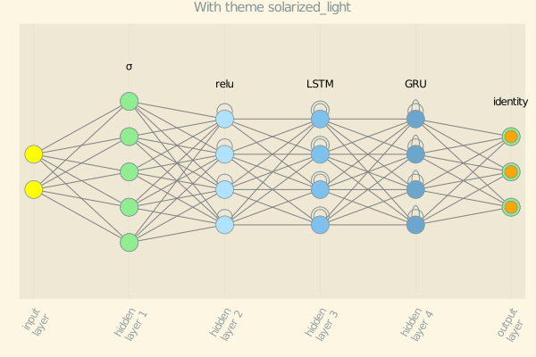
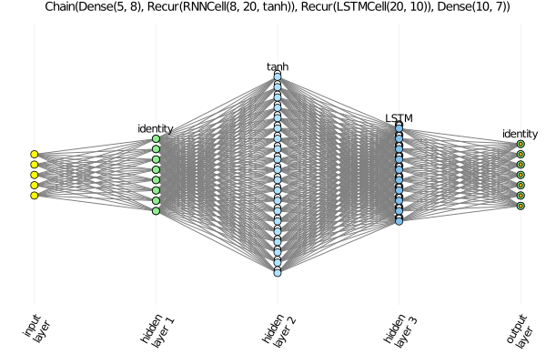

# ChainPlot

Plot visualization for [FluxML/Flux.jl](https://github.com/FluxML/Flux.jl)'s `Chain` neural networks.

It implements a plot recipe for `Flux.Chain` using the recipe tool from [JuliaPlots/RecipesBase.jl](https://github.com/JuliaPlots/RecipesBase.jl).

This repository is for a prototyping the recipe. There is currently no intention to make it a registered Julia package. Instead, the aim is to PR it into [FluxML/Flux.jl](https://github.com/FluxML/Flux.jl).

Nevertheless, one is welcome to install it directly via github, use it at your own will, and contribute to improve it.

## Current state

The aim is to obtain pictorial for all types of layers implemented in [Flux.jl] and in a way similar to the representations given in the following links.

* [Main Types of Neural Networks and its Applications — Tutorial](https://pub.towardsai.net/main-types-of-neural-networks-and-its-applications-tutorial-734480d7ec8e); and

* [The mostly complete chart of Neural Networks, explained](https://towardsdatascience.com/the-mostly-complete-chart-of-neural-networks-explained-3fb6f2367464).

At the moment, the recipe works for Dense and (RNN, LSTR, and GRU) Recurrent layers and for one-dimensional taylor-made function layers, as well as for Chains of such layers.

A little taste:

```julia
julia> using Flux

julia> using ChainPlot

julia> using Plots

julia> gr()
Plots.GRBackend()

julia> theme(:gruvbox_light)

julia> nnr = Chain(Dense(2,5,σ),RNN(5,4,relu), LSTM(4,4), GRU(4,4), Dense(4,3))
Chain(Dense(2, 5, σ), Recur(RNNCell(5, 4, relu)), Recur(LSTMCell(4, 4)), Dense(4, 3))

julia> plot(nnr, title="With theme solarized_light", titlefontsize=10)
```

Then we get the following plot:



Another example:

```julia
julia> theme(:default)

julia> nnrlwide = Chain(Dense(5,8,relu), RNN(8,20), LSTM(20,10), Dense(10,7))
Chain(Dense(5, 8, relu), Recur(RNNCell(8, 20, tanh)), Recur(LSTMCell(20, 10)), Dense(10, 7))

julia> plot(nnrlwide, title="$nnrlwide", titlefontsize=9)
```

Then we get the plot



Other examples can be seen in [tests/runtest.jl](tests/runtest.jl), with the several created plots saved to the folder [tests/img](tests/img/).
