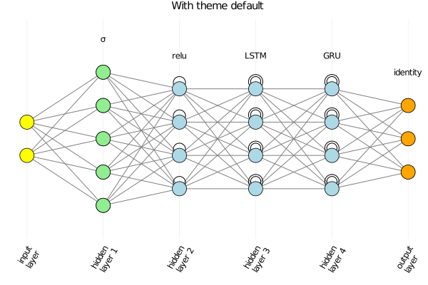
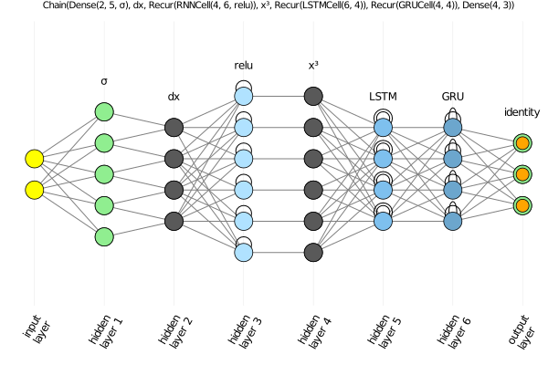
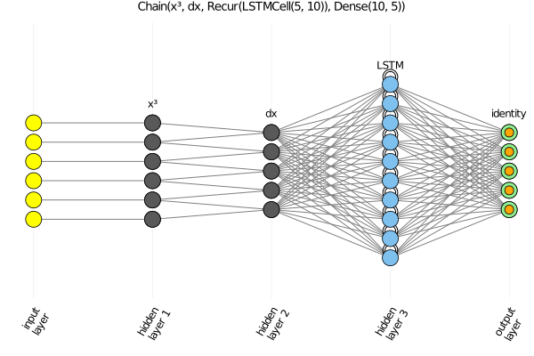

# ChainPlot

Plot visualization for [FluxML/Flux.jl](https://github.com/FluxML/Flux.jl)'s neural networks composed with [Flux.Chain](https://fluxml.ai/Flux.jl/stable/models/layers/#Flux.Chain).

## Description

It implements a plot recipe for `Flux.Chain` using the recipe tool from [JuliaPlots/RecipesBase.jl](https://github.com/JuliaPlots/RecipesBase.jl).

This repository is for prototyping the recipe. There is currently no intention to make it a registered Julia package. Instead, the aim is to PR it into [FluxML/Flux.jl](https://github.com/FluxML/Flux.jl).

Nevertheless, one is welcome to install it directly via github, use it, and contribute to improve it.

## Current state

The aim is to obtain pictorial representations for all types of layers implemented with [Flux.Chain](https://fluxml.ai/Flux.jl/stable/models/layers/#Flux.Chain) and in a way similar to the representations given in the following links.

* [Main Types of Neural Networks and its Applications — Tutorial](https://pub.towardsai.net/main-types-of-neural-networks-and-its-applications-tutorial-734480d7ec8e); and

* [The mostly complete chart of Neural Networks, explained](https://towardsdatascience.com/the-mostly-complete-chart-of-neural-networks-explained-3fb6f2367464).

At the moment, the recipe works for Dense and Recurrent layers and for one-dimensional taylor-made functional layers, as well as for Chains of such layers. There is only partial suppport for Convolutional and Pooling layers, but hopefully soon it will be working with any type of layer.

There is a distinction between netwoks starting with a layer with fixed-sized input (Dense and Recurrent) and networks starting with a layer with variable-sized input (Convolutional,  Pooling, and functional).

In the former case, just passing a network `m=Chain(...)` to plot works, e.g. `plot(m)`. In the latter case, one needs to pass along an initial input `a` as the second argument, like `plot(m,a)`, so that the plot recipe can properly figure out the size of each layer.

Any other argument for plot is accepted, like `plot(m,a, title="Convolutional network with $(length(m)) layers")`

## Examples

Here is a little taste of the current state. In all the examples below, one needs `Flux`, `ChainPlot` and `Plots`

```julia
julia> using Flux

julia> using ChainPlot

julia> using Plots

julia> gr()
Plots.GRBackend()
```

### Dense and Recurrent layers with a gruvbox_light theme

In our first example, we do it with two plot themes: `gruvbox_light` and `default`:

```julia
julia> theme(:gruvbox_light)

julia> nnr = Chain(Dense(2,5,σ),RNN(5,4,relu), LSTM(4,4), GRU(4,4), Dense(4,3))
Chain(Dense(2, 5, σ), Recur(RNNCell(5, 4, relu)), Recur(LSTMCell(4, 4)), Dense(4, 3))

julia> plot(nnr, title="With theme solarized_light", titlefontsize=10)
```


and

```julia
julia> theme(:default)

julia> plot(nnr, title="With theme default", titlefontsize=10)
```



### A wide neural network

Another example:

```julia
julia> theme(:default)

julia> nnrlwide = Chain(Dense(5,8,relu), RNN(8,20), LSTM(20,10), Dense(10,7))
Chain(Dense(5, 8, relu), Recur(RNNCell(8, 20, tanh)), Recur(LSTMCell(20, 10)), Dense(10, 7))

julia> plot(nnrlwide, title="$nnrlwide", titlefontsize=9)
```


### Variable-input layer

Variable-input functional layers are also accepted. If given as the first layer, then an initial input must be provided, otherwise, the input data is not needed. Here are two examples, illustrating each case.

```julia
julia> dx(x) = x[2:end]-x[1:end-1]
dx (generic function with 1 method)

julia> x³(x) = x.^3
x³ (generic function with 1 method)

julia> nna = Chain(Dense(2,5,σ), dx, RNN(4,6,relu), x³, LSTM(6,4), GRU(4,4), Dense(4,3))
Chain(Dense(2, 5, σ), dx, Recur(RNNCell(4, 6, relu)), x³, Recur(LSTMCell(6, 4)), Recur(GRUCell(4, 4)), Dense(4, 3))

julia> plot(nna, title="$nna", titlefontsize=7)
```



```julia
julia> nnx = Chain(x³, dx, LSTM(5,10), Dense(10,5))
Chain(x³, dx, Recur(LSTMCell(5, 10)), Dense(10, 5))

julia> input_data = rand(6);

julia> plot(nnx, input_data, title="$nnx", titlefontsize=9)
```



### Other examples

Other examples can be seen in [tests/runtest.jl](tests/runtest.jl), with the several created plots saved to the folder [tests/img](tests/img/).
